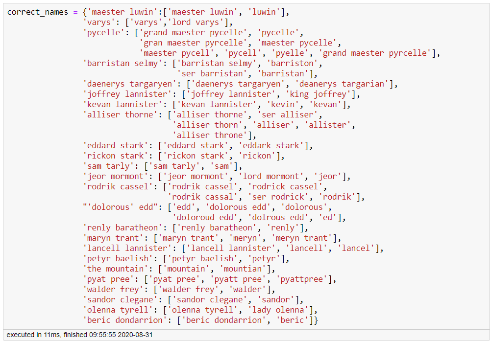
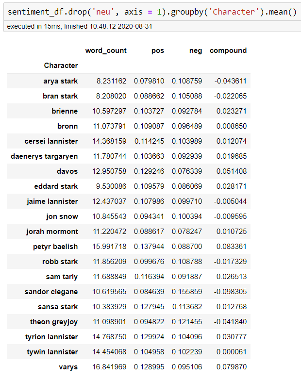
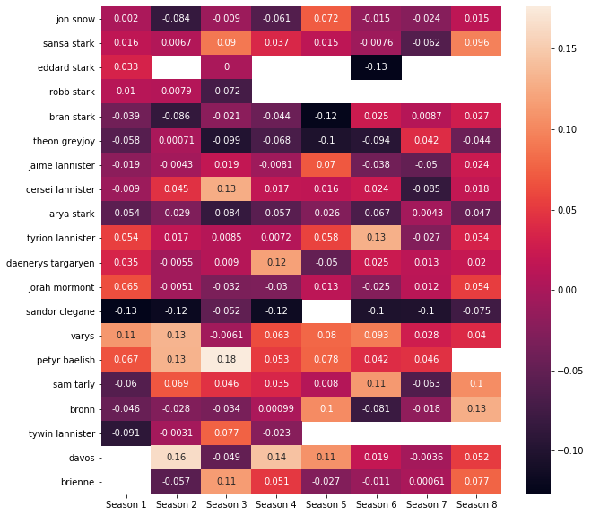
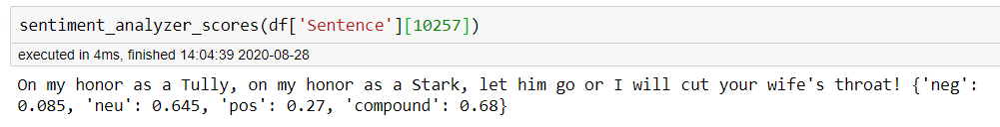
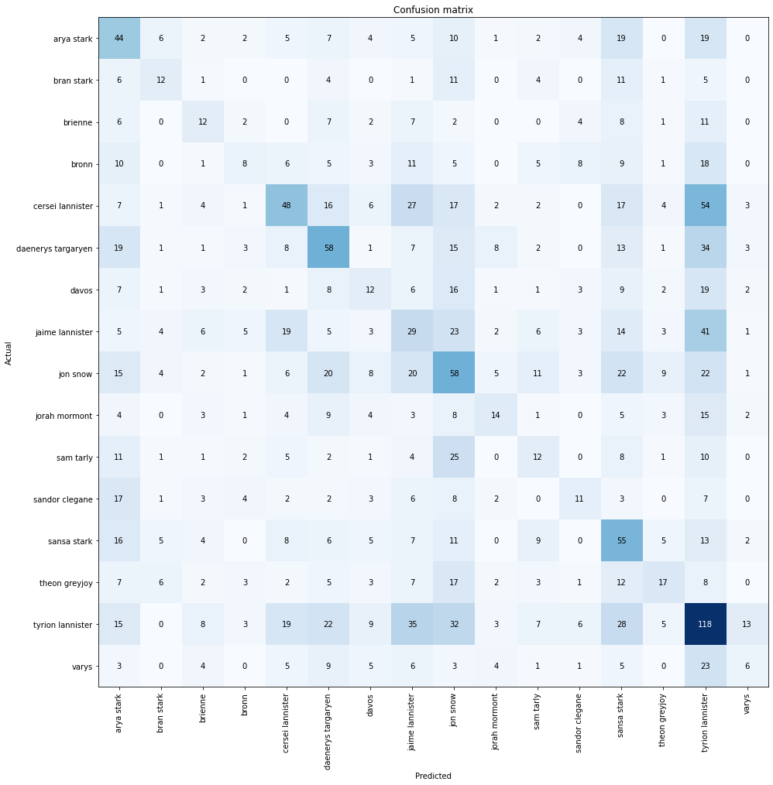
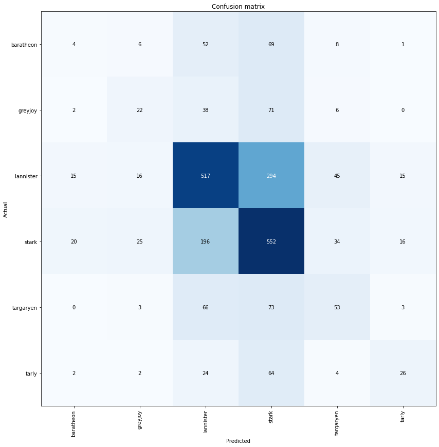
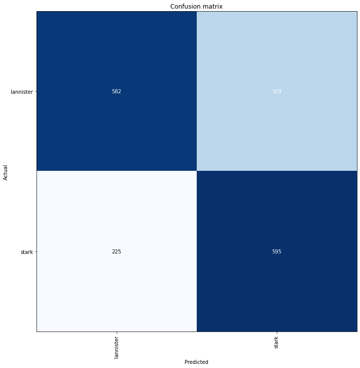

# Game of Throne Dialog Analysis

Presentables

* [Presentation (no link yet)]()
* [Presentation Video (no link yet)]()
* [Relevant Blog(no link yet)]()
* [Interactive App](https://got-character-lines-plot.herokuapp.com/)

## Purpose
To find meaningful insights by breaking down the series into seasons and even episodes. Attempt to create a classification system to determine which character would say a given line and identify speech sentiment. Identifying which characters were more positive or negative. 

## Data Used
[Game of Thrones Script - Kaggle](https://www.kaggle.com/albenft/game-of-thrones-script-all-seasons)

## Synopsis

Looking into dialogue line distribution and number of words per line it became very apparent that the show seemed to lean most heavily upon the character Tyrion who fairly consistently held the highest number of lines and most words spoken per season and often times per episode. The sheer number of unique characters that appear throughout the series proved to be a problem when trying to model for individual character identification as this ultimately reduced our data based upon the characters we were trying to classify. Initial modeling attemps provided overall accuracy around 24% for our characters with the most lines. Changing methods to classification by family name improved our results up to around 50% and removing all but the Lannisters and Starks gave us an accuracy of around 68%. As for sentiment analysis, most characters seem to average out to being mostly neutral with Sandor Clegane averaging out to be the most typically negative character and both Petyr Baelish and Varys being the most typically postive. Interestingly enough, Tywin Lannister also proved to be almost perfectly neutral.

## Analysis

Initial overview of the data found that there were some inconsistencies with the naming of several characters. Diving deeper into our list of unique characters the following were found to be corrected.

Fixing these names reduced our total number of unique characters from 564 to 520. From here, I began work on an interactive dashboard to allow for easier insight to individual seasons, episodes, and even characters. The Dashapp folder holders the scratch notebook used to test and verify the app. The app repo itself is located [here](https://github.com/pchadrow/got_character_app) and the interactive app can be veiwed and tested [here](https://got-character-lines-plot.herokuapp.com/).
______________________________
Through the app it became apparent quite quickly that the show seemed to hinge upon Tyrion Lannister. This started early on in the show and with the exception of Season 7, he maintained the most spoken character. Especially so in the final episode where he accounted for over 40% of all spoken words. Interestingly enough, while he did tend to have the most lines and most words, the privilege of longest monologue went to Talisa in Season 2 Episode 8. 

### Sentiment

Using nltk's Vader sentiment, we then looked into analyzing character sentiment.
Looking at our top characters average overall sentiment was interesting.

Sentiment aside, we saw that some characters, on average, had much more to say when they did speak than others. Both Varys and Petyr Baelish seemed average more words than anyone else when they spoke, and they also seemed to average more positive words than others when they spoke too. This is based off of the average compound score, where 1 is extremely positive, and -1 is extremely negative. While everyone seems to average out very close to neutral, the two of them had the highest avg score indiciating more positive dialogue overall. As for negativity, it seems that Sandor Clegane is our most negative character. What was also interesting was that Tywin Lannister appears to be almost perfectly neutral through the sentiment analysis. Broken down by season, we can also see some trends to comfirm some of this.

Note that the empty spaces indicate the character was not present that season, most likely due to being killed off. 

Another thing to keep in mind is that this analysis is based upon a pre-trained sentiment model. I feel this may be in the ballpark, but still have reservations upon it's accuracy based on specific examples like below.

I personally think it's somewhat debatable as to if this is actually a mostly positive sentiment.

## Modeling

Our initial goal was to attempt to classify which character is speaking. To start I created a language model based upon the ULMFiT method using the all of the available dialogue. What I then tried was to separate out Season 8 and train our model upon the remaining 7 seasons. From here I would have to then reduce our characters to only those that survived all the way to Season 8. Further filtering to only characters that had at least 300 lines to train with, reduced our classes from over 500 to 16.
The character classifier wasn't the best, achieving just shy of 25% overall accuracy.

It did seem that Lannisters and Starks had higher probability of accuracte classification which would lead to my next modeling attempt at classifying dialogue by family.

___________________
Classifying by family did provide a signiciant improvement to 50% overall accuracy.

An interesting takeaway from this plot is the likelihood of classification for both Greyjoys and Tarlys. Both of these key characters spent close aproximation with the Starks and both have significantly higher probabilites of being misclassified as a Stark as opposed to any other family.
__________
Finally, we'll look at only classifying Starks and Lannisters. Further reducing our classes to a binary problem provides us with an overall accuracy of around 68%.

## Conclusion

